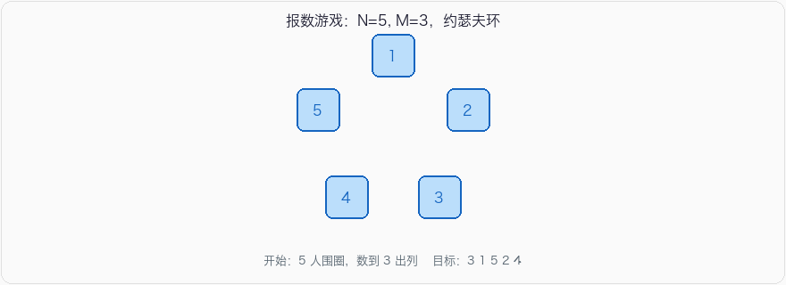

# 报数游戏

## 问题描述

有 \(N\) 个人围成一圈，编号 \(1 \sim N\)。从 1 号开始报数，报到 \(M\) 的人出列，下一个人从 1 重新报。重复直到所有人都出列，输出出列顺序。

这就是约瑟夫环。

## 输入

一行两个整数 \(N\) \(M\)（\(1 \le N, M \le 1000\)），人数和报数上限。

## 输出

一行 \(N\) 个整数，出列顺序，空格分隔。

## 示例

**输入：**

```
5 3
```

**输出：**

```
3 1 5 2 4
```

圈是 `1 2 3 4 5`：

1. 报 1、2、**3**，3 出列，剩下 `4 5 1 2`
2. 报 4、5、**1**，1 出列，剩下 `2 4 5`
3. 报 2、4、**5**，5 出列，剩下 `2 4`
4. 报 2、4、**2**，2 出列，剩下 `4`
5. 4 出列



## 思路

用队列模拟圈：每次把队头 \(M-1\) 个人挪到队尾，然后弹出队头，就是这次出列的人。

- \(N=5, M=3\)：`[1,2,3,4,5]` → 1、2 转到队尾 → `[3,4,5,1,2]` → 弹出 3。
- 循环直到队列空。

时间 \(O(NM)\)。\(N \le 1000\) 足够。也可以用循环链表，每次走 \(M-1\) 步删节点，复杂度一样。

坑：

- \(M=1\) 时不要进「挪 \(M-1\) 人」的循环，直接按 1 到 \(N\) 出列。
- Go 的 `container/ring`：`Unlink(1)` 返回被摘掉的那个环，剩下的环要靠调用者自己的指针。正确写法是先 `Next()` 到要删的人，记下后继，再 `Unlink`。

## 参考代码

### Python3

```python
from collections import deque

n, m = map(int, input().split())
q = deque(range(1, n + 1))
out = []
while q:
    q.rotate(1 - m)  # 把前 m-1 个转到队尾
    out.append(q.popleft())
print(' '.join(map(str, out)))
```

等价的显式写法：

```python
from collections import deque

n, m = map(int, input().split())
q = deque(range(1, n + 1))
out = []
while q:
    for _ in range(m - 1):
        q.append(q.popleft())
    out.append(q.popleft())
print(' '.join(map(str, out)))
```

### Java

```java
import java.util.ArrayDeque;
import java.util.Deque;
import java.util.Scanner;

public class Main {
    public static void main(String[] args) {
        Scanner sc = new Scanner(System.in);
        int n = sc.nextInt();
        int m = sc.nextInt();
        Deque<Integer> q = new ArrayDeque<>();
        for (int i = 1; i <= n; i++) q.offer(i);
        StringBuilder sb = new StringBuilder();
        while (!q.isEmpty()) {
            for (int i = 0; i < m - 1; i++) {
                q.offer(q.poll());
            }
            sb.append(q.poll()).append(' ');
        }
        System.out.println(sb.toString().trim());
    }
}
```

### C++

```cpp
#include <iostream>
#include <queue>
using namespace std;

int main() {
    int n, m;
    cin >> n >> m;
    queue<int> q;
    for (int i = 1; i <= n; i++) q.push(i);
    bool first = true;
    while (!q.empty()) {
        for (int i = 0; i < m - 1; i++) {
            q.push(q.front());
            q.pop();
        }
        if (!first) cout << ' ';
        first = false;
        cout << q.front();
        q.pop();
    }
    cout << '\n';
    return 0;
}
```

### C语言

```c
#include <stdio.h>
#include <stdlib.h>

typedef struct Node {
    int data;
    struct Node* next;
} Node;

int main(void) {
    int n, m;
    scanf("%d %d", &n, &m);

    Node* head = (Node*)malloc(sizeof(Node));
    head->data = 1;
    Node* cur = head;
    for (int i = 2; i <= n; i++) {
        cur->next = (Node*)malloc(sizeof(Node));
        cur = cur->next;
        cur->data = i;
    }
    cur->next = head;
    Node* prev = cur;
    cur = head;

    int count = 0;
    while (cur->next != cur) {
        count++;
        if (count == m) {
            printf("%d ", cur->data);
            prev->next = cur->next;
            Node* tmp = cur;
            cur = cur->next;
            free(tmp);
            count = 0;
        } else {
            prev = cur;
            cur = cur->next;
        }
    }
    printf("%d\n", cur->data);
    free(cur);
    return 0;
}
```

### JSNode

```javascript
const readline = require('readline');
const rl = readline.createInterface({ input: process.stdin, output: process.stdout });
rl.on('line', (line) => {
    const [n, m] = line.trim().split(/\s+/).map(Number);
    const q = [];
    for (let i = 1; i <= n; i++) q.push(i);
    const out = [];
    while (q.length) {
        for (let i = 0; i < m - 1; i++) q.push(q.shift());
        out.push(q.shift());
    }
    console.log(out.join(' '));
    rl.close();
});
```

### Go

```go
package main

import (
    "fmt"
    "strconv"
    "strings"
)

func main() {
    var n, m int
    fmt.Scan(&n, &m)
    q := make([]int, n)
    for i := 0; i < n; i++ {
        q[i] = i + 1
    }
    var out []string
    for len(q) > 0 {
        for i := 0; i < m-1; i++ {
            q = append(q, q[0])
            q = q[1:]
        }
        out = append(out, strconv.Itoa(q[0]))
        q = q[1:]
    }
    fmt.Println(strings.Join(out, " "))
}
```
