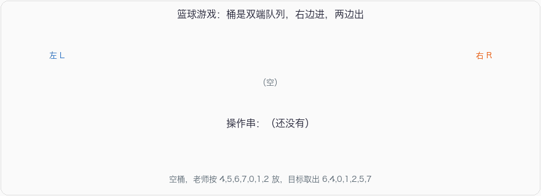

# 篮球游戏

## 问题描述

幼儿园有一个放倒的圆桶，是线性结构：

- 老师只能从**右边**把篮球放进去
- 小朋友可以从**左边或右边**取出
- 桶里只剩一个球时，必须从**左边**取

老师按顺序放入若干编号的球，问小朋友能不能按给定顺序取出。能的话输出每次取球是 `L` 还是 `R`；不能就输出 `NO`。

题面例子：放入 `1,2,3,4,5`。

- `1,2,3,4,5` 可以，全程左边取
- `3,1,2,4,5` 可以：先放 1、2、3，右边取出 3，再左边取 1、2，再放 4 左边取，再放 5 左边取，操作串 `RLLLL`
- `5,1,3,2,4` 不行

## 输入

- 第一行：老师依次放入的编号，逗号分隔
- 第二行：想检查的取出编号，逗号分隔

## 输出

能取出则打印由 `L`/`R` 组成的操作串，否则打印 `NO`。

## 示例

**输入：**

```
4,5,6,7,0,1,2
6,4,0,1,2,5,7
```

**输出：**

```
RLRRRLL
```

过程：

```
放 4,5,6 → 右边取出 6（R）→ 左边取出 4（L）
放 7,0   → 右边取出 0（R）
放 1     → 右边取出 1（R）
放 2     → 右边取出 2（R）→ 左边取出 5（L）→ 左边取出 7（L）
```



## 思路

桶就是双端队列。贪心模拟：

1. 按放入顺序，每次把一个球推进桶的右边。
2. 推进之后，能取就取：目标序列下一个如果等于桶的左端，记 `L` 并弹出左端；等于右端，记 `R` 并弹出右端。两端都不等于就停下，继续放下一个。
3. 两端同时等于目标时（桶里只剩一个球），按题意走左边，也就是先判断 `front`。
4. 全部放完后，操作串长度等于球数就是成功，否则 `NO`。

这不是普通栈的「出栈序列合法性」。栈只能从一端出；这里两端都能出，所以用 deque，每次看两端。

时间 \(O(N)\)：每个球进一次、出一次。

注意 Java 里 `ArrayDeque.peek()` 看的是队头（左边）。判断右边要用 `peekLast()`。最后用「操作串长度 == 放入数量」判断成功，不要拿已经空了的 `popList` 再去加长度。

## 参考代码

### Python3

```python
from collections import deque

push = list(map(int, input().split(',')))
want = list(map(int, input().split(',')))
bucket = deque()
ops = []
i = 0
for x in push:
    bucket.append(x)
    while bucket:
        if bucket[0] == want[i]:
            bucket.popleft()
            ops.append('L')
            i += 1
        elif bucket[-1] == want[i]:
            bucket.pop()
            ops.append('R')
            i += 1
        else:
            break
print(''.join(ops) if len(ops) == len(push) else 'NO')
```

### Java

```java
import java.util.ArrayDeque;
import java.util.Deque;
import java.util.Scanner;

public class Main {
    public static void main(String[] args) {
        Scanner sc = new Scanner(System.in);
        String[] pushIn = sc.nextLine().split(",");
        String[] popIn = sc.nextLine().split(",");
        int n = pushIn.length;
        int[] push = new int[n];
        int[] want = new int[n];
        for (int i = 0; i < n; i++) {
            push[i] = Integer.parseInt(pushIn[i]);
            want[i] = Integer.parseInt(popIn[i]);
        }
        Deque<Integer> bucket = new ArrayDeque<>();
        StringBuilder ops = new StringBuilder();
        int i = 0;
        for (int x : push) {
            bucket.addLast(x);
            while (!bucket.isEmpty()) {
                if (bucket.peekFirst() == want[i]) {
                    bucket.pollFirst();
                    ops.append('L');
                    i++;
                } else if (bucket.peekLast() == want[i]) {
                    bucket.pollLast();
                    ops.append('R');
                    i++;
                } else {
                    break;
                }
            }
        }
        System.out.println(ops.length() == n ? ops : "NO");
    }
}
```

### C++

```cpp
#include <iostream>
#include <deque>
#include <sstream>
#include <string>
using namespace std;

deque<int> parse(const string& s) {
    deque<int> d;
    stringstream ss(s);
    string tok;
    while (getline(ss, tok, ',')) d.push_back(stoi(tok));
    return d;
}

int main() {
    string a, b;
    getline(cin, a);
    getline(cin, b);
    deque<int> push = parse(a), want = parse(b);
    deque<int> bucket;
    string ops;
    int i = 0;
    for (int x : push) {
        bucket.push_back(x);
        while (!bucket.empty()) {
            if (bucket.front() == want[i]) {
                bucket.pop_front();
                ops += 'L';
                i++;
            } else if (bucket.back() == want[i]) {
                bucket.pop_back();
                ops += 'R';
                i++;
            } else break;
        }
    }
    cout << (ops.size() == push.size() ? ops : string("NO")) << '\n';
    return 0;
}
```

### C语言

```c
#include <stdio.h>
#include <stdlib.h>
#include <string.h>

#define MAXN 10000

static int parse_line(int* a) {
    char buf[1 << 16];
    if (!fgets(buf, sizeof buf, stdin)) return 0;
    int n = 0;
    char* p = strtok(buf, ",\r\n");
    while (p) {
        a[n++] = atoi(p);
        p = strtok(NULL, ",\r\n");
    }
    return n;
}

int main(void) {
    int push[MAXN], want[MAXN], bucket[MAXN];
    int n = parse_line(push);
    parse_line(want);
    int L = 0, R = 0; /* [L, R) */
    char ops[MAXN + 1];
    int k = 0, i = 0;
    for (int p = 0; p < n; p++) {
        bucket[R++] = push[p];
        while (L < R) {
            if (bucket[L] == want[i]) {
                L++;
                ops[k++] = 'L';
                i++;
            } else if (bucket[R - 1] == want[i]) {
                R--;
                ops[k++] = 'R';
                i++;
            } else break;
        }
    }
    if (k == n) {
        ops[k] = '\0';
        puts(ops);
    } else {
        puts("NO");
    }
    return 0;
}
```

### JSNode

```javascript
const readline = require('readline');
const rl = readline.createInterface({ input: process.stdin, output: process.stdout });
const lines = [];
rl.on('line', (line) => lines.push(line.trim()));
rl.on('close', () => {
    const push = lines[0].split(',').map(Number);
    const want = lines[1].split(',').map(Number);
    const bucket = [];
    let ops = '';
    let i = 0;
    for (const x of push) {
        bucket.push(x);
        while (bucket.length) {
            if (bucket[0] === want[i]) {
                bucket.shift();
                ops += 'L';
                i++;
            } else if (bucket[bucket.length - 1] === want[i]) {
                bucket.pop();
                ops += 'R';
                i++;
            } else break;
        }
    }
    console.log(ops.length === push.length ? ops : 'NO');
});
```

### Go

```go
package main

import (
    "bufio"
    "fmt"
    "os"
    "strconv"
    "strings"
)

func parse(s string) []int {
    parts := strings.Split(strings.TrimSpace(s), ",")
    out := make([]int, len(parts))
    for i, p := range parts {
        out[i], _ = strconv.Atoi(p)
    }
    return out
}

func main() {
    in := bufio.NewScanner(os.Stdin)
    in.Scan()
    push := parse(in.Text())
    in.Scan()
    want := parse(in.Text())
    bucket := make([]int, 0, len(push))
    var ops strings.Builder
    i := 0
    for _, x := range push {
        bucket = append(bucket, x)
        for len(bucket) > 0 {
            if bucket[0] == want[i] {
                bucket = bucket[1:]
                ops.WriteByte('L')
                i++
            } else if bucket[len(bucket)-1] == want[i] {
                bucket = bucket[:len(bucket)-1]
                ops.WriteByte('R')
                i++
            } else {
                break
            }
        }
    }
    if ops.Len() == len(push) {
        fmt.Println(ops.String())
    } else {
        fmt.Println("NO")
    }
}
```
