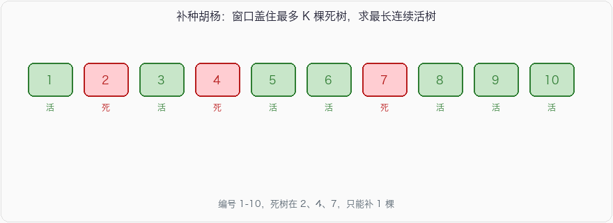

# 补种未成活胡杨

## 问题描述

沙漠里新种了 \(N\) 棵胡杨，编号 \(1 \sim N\)，排成一排。一个月后有 \(M\) 棵没成活。现在最多能补种 \(K\) 棵（只能补种死掉的位置，不能新开坑）。问补种之后，最长的连续成活胡杨有多少棵。

## 输入

- 第一行：整数 \(N\)，总种植数量，\(1 \le N \le 10^5\)
- 第二行：整数 \(M\)，未成活数量，\(1 \le M \le N\)
- 第三行：\(M\) 个空格分隔的编号，已按从小到大排好
- 第四行：整数 \(K\)，最多可补种数量，\(0 \le K \le M\)

## 输出

一个整数，最多的连续胡杨棵树。

## 示例

**输入：**

```
5
2
2 4
1
```

**输出：**

```
3
```

补 2 得到 \(1\sim3\)，补 4 得到 \(3\sim5\)，都是 3。

**输入：**

```
10
3
2 4 7
1
```

**输出：**

```
6
```

补第 7 棵，连续段是 \(5\sim10\)。



## 思路

把死树编号看成数轴上的点。补 \(K\) 棵，等于允许一段连续区间里最多盖住 \(K\) 个死点，这段区间两端再碰到死树就不能再往外扩。

给死树数组加上哨兵 `0` 和 `N+1`：

```
dead' = [0] + dead + [N+1]
```

窗口 \([i, i+K]\) 表示补种 `dead'[i+1] … dead'[i+K]` 这 \(K\) 棵死树。窗口左边那棵死树 `dead'[i]` 不补，右边 `dead'[i+K+1]` 也不补，所以连续成活长度是：

\[
\textit{dead}'[i+K+1] - \textit{dead}'[i] - 1
\]

对每个合法 \(i\) 取最大。\(K \ge M\) 时整排都能救活，直接返回 \(N\)。

示例 2：`dead' = [0, 2, 4, 7, 11]`，\(K=1\)

| 窗口 | 补哪棵 | 长度 |
| --- | --- | --- |
| 0..2 | 2 | \(4-0-1=3\) |
| 2..4 | 4 | \(7-2-1=4\) |
| 4..7 | 7 | \(11-4-1=6\) |

\(N\) 到 \(10^5\)，不能去铺整排再滑窗（当然 \(O(N)\) 也过，但 \(O(M)\) 更干净）。

## 参考代码

### Python3

```python
n = int(input())
m = int(input())
dead = list(map(int, input().split()))
k = int(input())
if k >= m:
    print(n)
else:
    d = [0] + dead + [n + 1]
    ans = 0
    for i in range(len(d) - (k + 1)):
        ans = max(ans, d[i + k + 1] - d[i] - 1)
    print(ans)
```

### Java

```java
import java.util.Scanner;

public class Main {
    public static void main(String[] args) {
        Scanner sc = new Scanner(System.in);
        int n = sc.nextInt();
        int m = sc.nextInt();
        int[] dead = new int[m + 2];
        dead[0] = 0;
        for (int i = 1; i <= m; i++) dead[i] = sc.nextInt();
        dead[m + 1] = n + 1;
        int k = sc.nextInt();
        if (k >= m) {
            System.out.println(n);
            return;
        }
        int ans = 0;
        for (int i = 0; i + k + 1 < dead.length; i++) {
            ans = Math.max(ans, dead[i + k + 1] - dead[i] - 1);
        }
        System.out.println(ans);
    }
}
```

### C++

```cpp
#include <iostream>
#include <vector>
#include <algorithm>
using namespace std;

int main() {
    int n, m, k;
    cin >> n >> m;
    vector<int> d(m + 2);
    d[0] = 0;
    for (int i = 1; i <= m; i++) cin >> d[i];
    d[m + 1] = n + 1;
    cin >> k;
    if (k >= m) {
        cout << n << '\n';
        return 0;
    }
    int ans = 0;
    for (int i = 0; i + k + 1 < (int)d.size(); i++) {
        ans = max(ans, d[i + k + 1] - d[i] - 1);
    }
    cout << ans << '\n';
    return 0;
}
```

### C语言

```c
#include <stdio.h>
#include <stdlib.h>

int main(void) {
    int n, m, k;
    scanf("%d %d", &n, &m);
    int* d = (int*)malloc((m + 2) * sizeof(int));
    d[0] = 0;
    for (int i = 1; i <= m; i++) scanf("%d", &d[i]);
    d[m + 1] = n + 1;
    scanf("%d", &k);
    if (k >= m) {
        printf("%d\n", n);
        free(d);
        return 0;
    }
    int ans = 0;
    for (int i = 0; i + k + 1 <= m + 1; i++) {
        int len = d[i + k + 1] - d[i] - 1;
        if (len > ans) ans = len;
    }
    printf("%d\n", ans);
    free(d);
    return 0;
}
```

### JSNode

```javascript
const readline = require('readline');
const rl = readline.createInterface({ input: process.stdin, output: process.stdout });
const lines = [];
rl.on('line', (line) => lines.push(line.trim()));
rl.on('close', () => {
    const n = parseInt(lines[0], 10);
    const m = parseInt(lines[1], 10);
    const dead = lines[2].split(/\s+/).map(Number);
    const k = parseInt(lines[3], 10);
    if (k >= m) {
        console.log(n);
        return;
    }
    const d = [0, ...dead, n + 1];
    let ans = 0;
    for (let i = 0; i + k + 1 < d.length; i++) {
        ans = Math.max(ans, d[i + k + 1] - d[i] - 1);
    }
    console.log(ans);
});
```

### Go

```go
package main

import "fmt"

func main() {
    var n, m, k int
    fmt.Scan(&n, &m)
    d := make([]int, m+2)
    d[0] = 0
    for i := 1; i <= m; i++ {
        fmt.Scan(&d[i])
    }
    d[m+1] = n + 1
    fmt.Scan(&k)
    if k >= m {
        fmt.Println(n)
        return
    }
    ans := 0
    for i := 0; i+k+1 < len(d); i++ {
        if v := d[i+k+1] - d[i] - 1; v > ans {
            ans = v
        }
    }
    fmt.Println(ans)
}
```
