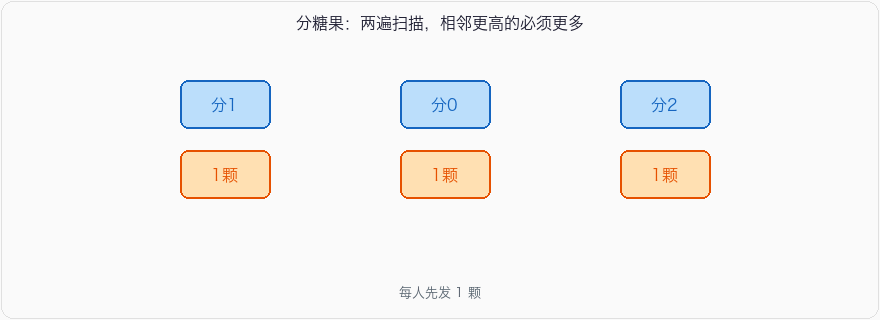

# 贪心

## 1、**分糖果问题**

### 1.1、问题描述

一群孩子做游戏，现在请你根据游戏得分来发糖果，要求如下：

1. 每个孩子不管得分多少，起码分到一个糖果。
2. 任意两个相邻的孩子之间，得分较多的孩子必须拿多一些糖果。(若相同则无此限制)

给定一个数组*arr* 代表得分数组，请返回最少需要多少糖果。

> 示例1
>
> 输入：[1,1,2]
>
> 返回值：4
>
> 说明：最优分配方案为1,1,2 
>
> 示例2
>
> 输入：[1,1,1]
>
> 返回值：3
>
> 说明：最优分配方案是1,1,1 

### 1.2、思路及代码

相邻约束是双向的，一遍贪心顾不上山谷两边，所以左右各扫一次。



思路：

1. 初始化一个糖果数组 `candies`，所有元素初始值为1，表示每个孩子初始至少分到一个糖果。
2. 从左到右遍历一次数组 `arr`，如果右边的孩子得分比左边的孩子高，右边的孩子的糖果数量应该比左边的多。因此，如果 `arr[i] > arr[i-1]`，则 `candies[i] = candies[i-1] + 1`。
3. 从右到左遍历一次数组 `arr`，如果左边的孩子得分比右边的孩子高，并且左边的糖果数量不大于右边的，那么更新左边孩子的糖果数量。即，如果 `arr[i] > arr[i+1]` 且 `candies[i] <= candies[i+1]`，则 `candies[i] = candies[i+1] + 1`。
4. 累计所有孩子的糖果数量。

参考代码：

```C++
#include <iostream>
#include <vector>

using namespace std;

// 函数：计算最少需要多少糖果
int minCandies(vector<int>& arr) {
    int n = arr.size();
    if (n <= 1) {
        return n; // 当数组长度小于等于1时，每个孩子至少分到一个糖果，返回数组长度
    }

    vector<int> candies(n, 1); // 初始化糖果数组，所有元素初始值为1

    // 从左到右遍历数组，更新右边孩子的糖果数量
    for (int i = 1; i < n; i++) {
        if (arr[i] > arr[i-1]) {
            candies[i] = candies[i-1] + 1;
        }
    }

    // 从右到左遍历数组，更新左边孩子的糖果数量
    for (int i = n - 2; i >= 0; i--) {
        if (arr[i] > arr[i+1] && candies[i] <= candies[i+1]) {
            candies[i] = candies[i+1] + 1;
        }
    }

    // 累计所有孩子的糖果数量
    int result = 0;
    for (int candy : candies) {
        result += candy;
    }

    return result;
}

int main() {
    // 输入数组
    vector<int> arr1 = {1,0,2};
    vector<int> arr2 = {1,2,2};

    // 输出结果
    cout << "示例1结果: " << minCandies(arr1) << endl; // 期望输出: 5
    cout << "示例2结果: " << minCandies(arr2) << endl; // 期望输出: 4

    return 0;
}
```

## 2、**主持人调度（二）**

### 2.1、问题描述

有 n 个活动即将举办，每个活动都有开始时间与活动的结束时间，第 i 个活动的开始时间是 start(i) ,第 i 个活动的结束时间是 end(i) ,举办某个活动就需要为该活动准备一个活动主持人。 一位活动主持人在同一时间只能参与一个活动。并且活动主持人需要全程参与活动，换句话说，一个主持人参与了第 i 个活动，那么该主持人在 (start(i),end(i)) 这个时间段不能参与其他任何活动。求为了成功举办这 n 个活动，最少需要多少名主持人。

> 示例1
>
> 输入：2,[[1,2],[2,3]]
>
> 返回值：1
>
> 说明：只需要一个主持人就能成功举办这两个活动      
>
> 示例2
>
> 输入：2,[[1,3],[2,4]]
>
> 返回值：2
>
> 说明：需要两个主持人才能成功举办这两个活动

### 2.2、思路及代码

这题问的是「同一时刻最多有几场活动在开」，不是「按结束时间贪心接活动」。按结束时间排序、只盯一个主持人，会把能错开的场次也算成新开一个主持人，答案偏大；反过来，三个两两重叠的活动也可能被漏计。

题面写的是开区间 `(start, end)`：`[1,2]` 和 `[2,3]` 在时刻 2 不冲突，示例 1 才是 1。

扫描线：

1. 把所有开始时间、结束时间抽出来分别排序。
2. 两个指针扫。下一个事件如果是开始（`starts[i] < ends[j]`），当前占用 +1，刷新最大值；否则是结束，占用 -1。
3. 相等时先处理结束——主持人当场腾出来，下一场直接复用。

时间 \(O(n \log n)\)，额外空间 \(O(n)\)。也可以上最小堆：按开始时间排序，堆里放结束时间，堆顶能腾就 pop，否则新开一个。扫描线更短。

参考代码：

```C++
#include <iostream>
#include <vector>
#include <algorithm>

using namespace std;

int minHosts(int n, vector<vector<int>>& activities) {
    if (n <= 0 || activities.empty()) return 0;

    vector<int> starts(n), ends(n);
    for (int i = 0; i < n; i++) {
        starts[i] = activities[i][0];
        ends[i] = activities[i][1];
    }
    sort(starts.begin(), starts.end());
    sort(ends.begin(), ends.end());

    int i = 0, j = 0, cur = 0, ans = 0;
    while (i < n) {
        if (starts[i] < ends[j]) { // 新活动开始，且上一场还没结束
            cur++;
            ans = max(ans, cur);
            i++;
        } else {                   // 有主持人腾出来（含 start == end）
            cur--;
            j++;
        }
    }
    return ans;
}

int main() {
    int n1 = 2;
    vector<vector<int>> activities1 = {{1, 2}, {2, 3}};

    int n2 = 2;
    vector<vector<int>> activities2 = {{1, 3}, {2, 4}};

    cout << "示例1结果: " << minHosts(n1, activities1) << endl; // 1
    cout << "示例2结果: " << minHosts(n2, activities2) << endl; // 2

    return 0;
}
```