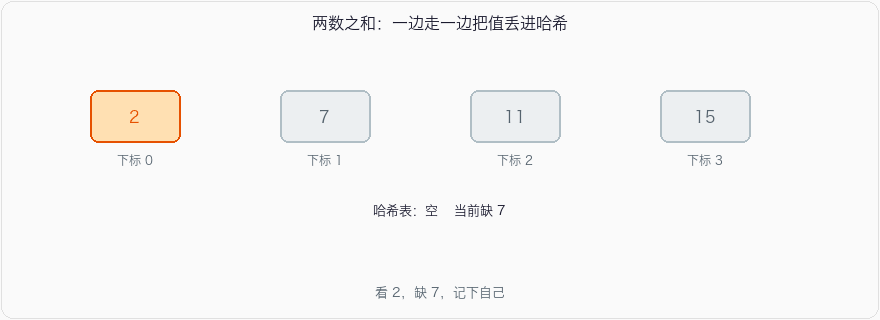

# 两数之和

_LeetCode 1_

## 问题描述

给定一个整数数组 `nums` 和一个整数目标值 `target`，请你在该数组中找出 **和为目标值** *`target`* 的那 **两个** 整数，并返回它们的数组下标。

你可以假设每种输入只会对应一个答案。但是，数组中同一个元素在答案里不能重复出现。

你可以按任意顺序返回答案。

**示例 1：**

```
输入：nums = [2,7,11,15], target = 9
输出：[0,1]
解释：因为 nums[0] + nums[1] == 9 ，返回 [0, 1] 。
```

**示例 2：**

```
输入：nums = [3,2,4], target = 6
输出：[1,2]
```

**示例 3：**

```
输入：nums = [3,3], target = 6
输出：[0,1]
```

## 思路

#### 暴力：两层循环，\(O(n^2)\)。

#### 哈希表，一边走一边记：

看 `nums[i]` 时，问哈希里有没有 `target - nums[i]`。有就返回那对下标；没有就把自己放进去，留给后面的人来找。



必须**先查再插入**。`[3, 3], target = 6` 这种，如果先插入再查，会把同一个 3 用两次。题面禁止同一个元素出现两次。

一遍哈希 \(O(n)\) 时间、\(O(n)\) 空间。返回的是下标，不是值，所以哈希的 value 存下标。

## 参考代码

#### C++

```
#include <iostream>
#include <vector>
#include <unordered_map>

using namespace std;

// 在数组中查找和为目标值的两个数的下标
vector<int> twoSum(vector<int>& nums, int target) {
    // 创建一个哈希表，键为数组中的元素，值为元素的下标
    unordered_map<int, int> numMap;
    
    // 遍历数组
    for (int i = 0; i < nums.size(); ++i) {
        // 计算目标值与当前元素的差值
        int complement = target - nums[i];
        
        // 检查差值是否存在于哈希表中
        if (numMap.find(complement) != numMap.end()) {
            // 如果存在，返回差值的下标和当前元素的下标
            return {numMap[complement], i};
        }
        
        // 将当前元素及其下标存入哈希表
        numMap[nums[i]] = i;
    }
    
    // 如果没有找到符合条件的两个数，返回空数组
    return {};
}

int main() {
    // 示例输入
    vector<int> nums1 = {2, 7, 11, 15};
    int target1 = 9;
    vector<int> nums2 = {3, 2, 4};
    int target2 = 6;
    vector<int> nums3 = {3, 3};
    int target3 = 6;

    // 调用函数并输出结果
    vector<int> result1 = twoSum(nums1, target1);
    cout << "输入：nums = [2,7,11,15], target = 9" << endl;
    cout << "输出：[" << result1[0] << "," << result1[1] << "]" << endl;

    vector<int> result2 = twoSum(nums2, target2);
    cout << "输入：nums = [3,2,4], target = 6" << endl;
    cout << "输出：[" << result2[0] << "," << result2[1] << "]" << endl;

    vector<int> result3 = twoSum(nums3, target3);
    cout << "输入：nums = [3,3], target = 6" << endl;
    cout << "输出：[" << result3[0] << "," << result3[1] << "]" << endl;

    return 0;
}
```

#### Java

```
import java.util.HashMap;
import java.util.Map;

public class TwoSum {
    // 在数组中查找和为目标值的两个数的下标
    public static int[] twoSum(int[] nums, int target) {
        // 创建一个哈希表，键为数组中的元素，值为元素的下标
        Map<Integer, Integer> numMap = new HashMap<>();

        // 遍历数组
        for (int i = 0; i < nums.length; i++) {
            // 计算目标值与当前元素的差值
            int complement = target - nums[i];

            // 检查差值是否存在于哈希表中
            if (numMap.containsKey(complement)) {
                // 如果存在，返回差值的下标和当前元素的下标
                return new int[] { numMap.get(complement), i };
            }

            // 将当前元素及其下标存入哈希表
            numMap.put(nums[i], i);
        }

        // 如果没有找到符合条件的两个数，返回空数组
        return new int[] {};
    }

    public static void main(String[] args) {
        // 示例输入
        int[] nums1 = { 2, 7, 11, 15 };
        int target1 = 9;
        int[] nums2 = { 3, 2, 4 };
        int target2 = 6;
        int[] nums3 = { 3, 3 };
        int target3 = 6;

        // 调用函数并输出结果
        int[] result1 = twoSum(nums1, target1);
        System.out.println("输入：nums = [2,7,11,15], target = 9");
        System.out.println("输出：[" + result1[0] + "," + result1[1] + "]");

        int[] result2 = twoSum(nums2, target2);
        System.out.println("输入：nums = [3,2,4], target = 6");
        System.out.println("输出：[" + result2[0] + "," + result2[1] + "]");

        int[] result3 = twoSum(nums3, target3);
        System.out.println("输入：nums = [3,3], target = 6");
        System.out.println("输出：[" + result3[0] + "," + result3[1] + "]");
    }
}
```

#### Python

```
def two_sum(nums, target):
    # 创建一个字典，键为数组中的元素，值为元素的下标
    num_map = {}

    # 遍历数组
    for i, num in enumerate(nums):
        # 计算目标值与当前元素的差值
        complement = target - num

        # 检查差值是否存在于字典中
        if complement in num_map:
            # 如果存在，返回差值的下标和当前元素的下标
            return [num_map[complement], i]

        # 将当前元素及其下标存入字典
        num_map[num] = i

    # 如果没有找到符合条件的两个数，返回空数组
    return []

# 示例输入
nums1 = [2, 7, 11, 15]
target1 = 9
nums2 = [3, 2, 4]
target2 = 6
nums3 = [3, 3]
target3 = 6

# 调用函数并输出结果
print(f"输入：nums = {nums1}, target = {target1}")
print(f"输出：{two_sum(nums1, target1)}")

print(f"输入：nums = {nums2}, target = {target2}")
print(f"输出：{two_sum(nums2, target2)}")

print(f"输入：nums = {nums3}, target = {target3}")
print(f"输出：{two_sum(nums3, target3)}")
```

