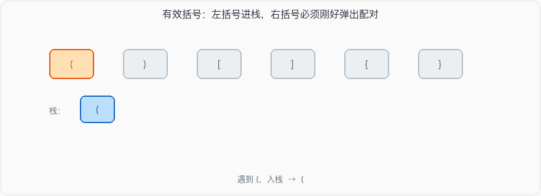

# 有效的括号

_LeetCode 20_

## 问题描述

给定一个只包括 `'('`，`')'`，`'{'`，`'}'`，`'['`，`']'` 的字符串 `s` ，判断字符串是否有效。

有效字符串需满足：

1. 左括号必须用相同类型的右括号闭合。
2. 左括号必须以正确的顺序闭合。
3. 每个右括号都有一个对应的相同类型的左括号。

**示例 1：**

```
输入：s = "()"
输出：true
```

**示例 2：**

```
输入：s = "()[]{}"
输出：true
```

**示例 3：**

```
输入：s = "(]"
输出：false
```

## 思路

括号匹配是栈的教科书场景：左括号进栈，右括号必须刚好弹出对应的左括号。遍历结束栈还得是空的。



1. 用栈存还没配上的左括号。
2. 遇到左括号就压栈。
3. 遇到右括号：栈空，或栈顶对不上，直接 `false`；对得上就弹出。
4. 扫完看栈空不空。`([)]` 这种交叉、`(((` 这种只开不关，都会在第 3 或第 4 步被拦住。

长度是奇数可以直接 `false`。映射用哈希：`)→(`、`]→[`、`}→{`，判断的时候只查右括号。

## 参考代码

#### C++

```
#include <iostream>
#include <stack>
#include <unordered_map>

using namespace std;

bool isValid(string s) {
    stack<char> stk; // 用于存放左括号的栈
    unordered_map<char, char> mappings = {
        {')', '('},
        {'}', '{'},
        {']', '['}
    }; // 用于存放右括号与其对应的左括号的映射关系

    // 遍历输入字符串
    for (char c : s) {
        // 如果是左括号，压入栈中
        if (c == '(' || c == '{' || c == '[') {
            stk.push(c);
        } else {
            // 如果是右括号
            // 判断栈是否为空或者栈顶元素是否与当前右括号匹配
            if (stk.empty() || stk.top() != mappings[c]) {
                return false; // 不匹配，返回 false
            }
            stk.pop(); // 匹配，将栈顶元素出栈
        }
    }

    // 最后判断栈是否为空，如果为空则说明所有括号都匹配
    return stk.empty();
}

int main() {
    string s = "{[()]}";
    cout << isValid(s) << endl; // 输出 1，表示有效

    s = "{[(])}";
    cout << isValid(s) << endl; // 输出 0，表示无效

    return 0;
}
```

#### Java

```
import java.util.HashMap;
import java.util.Map;
import java.util.Stack;

public class ValidParentheses {
    public boolean isValid(String s) {
        Stack<Character> stack = new Stack<>();
        Map<Character, Character> mappings = new HashMap<>();
        mappings.put(')', '(');
        mappings.put('}', '{');
        mappings.put(']', '[');

        for (char c : s.toCharArray()) {
            if (mappings.containsValue(c)) {
                stack.push(c);
            } else if (mappings.containsKey(c)) {
                if (stack.isEmpty() || stack.pop() != mappings.get(c)) {
                    return false;
                }
            }
        }

        return stack.isEmpty();
    }

    public static void main(String[] args) {
        ValidParentheses vp = new ValidParentheses();
        String s = "{[()]}";
        System.out.println(vp.isValid(s)); // 输出 true，表示有效

        s = "{[(])}";
        System.out.println(vp.isValid(s)); // 输出 false，表示无效
    }
}
```

#### Python

```
class Solution:
    def isValid(self, s: str) -> bool:
        stack = []
        mappings = {')': '(', '}': '{', ']': '['}

        for char in s:
            if char in mappings.values():
                stack.append(char)
            elif char in mappings.keys():
                if not stack or stack.pop() != mappings[char]:
                    return False
            else:
                return False

        return not stack

# 测试代码
s = Solution()
print(s.isValid("{[()]}"))  # 输出 True，表示有效
print(s.isValid("{[(])}"))  # 输出 False，表示无效
```

